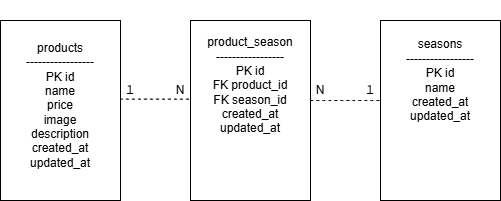

# Mogitate

## アプリケーション概要

商品情報を管理するためのアプリケーションです。
商品を登録・編集・削除することができます。

## 環境構築

### Dockerビルド

```
git clone リポジトリURL
docker-compose up -d
```

### Laravel環境構築

```
docker-compose exec app bash
composer install
cp .env.example .env
php artisan key:generate
php artisan migrate
```

## 使用技術

* PHP
* Laravel
* MySQL
* Docker
* Nginx

## ER図



## URL

開発環境：http://localhost:8000
